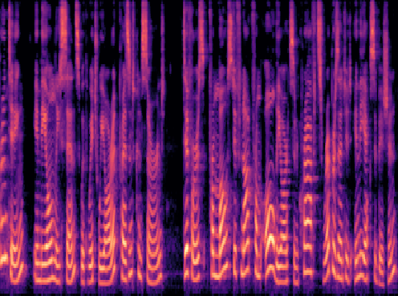
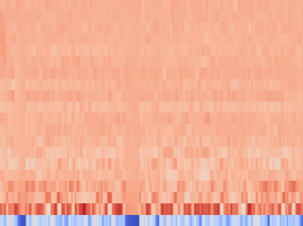
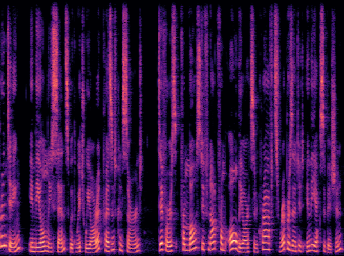

# Requirements

Requires the [audio-dataset-converter-visualization](https://github.com/waikato-datamining/audio-dataset-converter-visualization) library.

# Plugins

For the following examples, data from the [LJ Speech Dataset](https://keithito.com/LJ-Speech-Dataset/) was used.


## Mel spectrogram

`to-mel-spectrogram` - outputs Mel spectrogram images

```bash
adc-convert \
  -l INFO \
    from-data \
      -l INFO \
      -i "./input/*.wav" \
      -t sp \
    to-mel-spectrogram \
      -l INFO \
      -o ./output
```




## MFCC spectrogram

`to-mfcc-spectrogram` - outputs Mel-frequency cepstral coefficients images

```bash
adc-convert \
  -l INFO \
    from-data \
      -l INFO \
      -i "./input/*.wav" \
      -t sp \
    to-mfcc-spectrogram \
      -l INFO \
      -o ./output
```




## STFT spectrogram

`to-stft-spectrogram` - outputs short time fourier transform (STFT) spectrogram images

```bash
adc-convert \
  -l INFO \
    from-data \
      -l INFO \
      -i "./input/*.wav" \
      -t sp \
    to-stft-spectrogram \
      -l INFO \
      -o ./output
```


